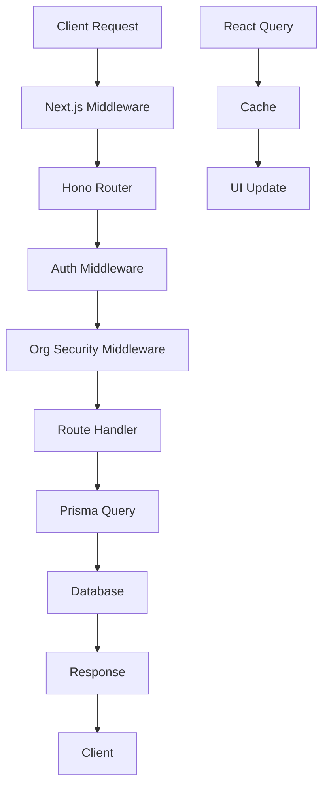

# Architecture Analysis

*Last Updated: January 26, 2025*

## 🏗️ **Overall Architecture Score: 8/10**

Excellent design decisions with some execution gaps.

## 📐 **System Architecture Overview**

```
┌─────────────────────────────────────────────────────────────┐
│                    P-Core Architecture                      │
├─────────────────────────────────────────────────────────────┤
│                                                             │
│  ┌─────────────┐    ┌─────────────┐    ┌─────────────┐     │
│  │   Next.js   │    │    Hono     │    │   Prisma    │     │
│  │  App Router │◄──►│ Edge Runtime│◄──►│  Database   │     │
│  │             │    │             │    │             │     │
│  └─────────────┘    └─────────────┘    └─────────────┘     │
│                                                             │
│  ┌─────────────┐    ┌─────────────┐    ┌─────────────┐     │
│  │ React Query │    │  shadcn/ui  │    │ TypeScript  │     │
│  │   Caching   │    │ Components  │    │   Types     │     │
│  └─────────────┘    └─────────────┘    └─────────────┘     │
│                                                             │
└─────────────────────────────────────────────────────────────┘
```

## ✅ **Architectural Strengths**

### **1. Modern Tech Stack**
```typescript
// Excellent technology choices
- Next.js 15 (App Router)     // Latest features, performance
- TypeScript (Strict mode)    // Type safety
- Hono.js (Edge Runtime)      // Fast API responses
- Prisma ORM                  // Type-safe database access
- React Query                 // Client state management
- Tailwind + shadcn/ui        // Consistent design system
```

### **2. Feature-Based Architecture**
```
features/
├── dashboard/
│   ├── api/           # Feature-specific hooks
│   ├── components/    # UI components
│   └── types/         # Type definitions
├── organization-management/
├── school-management/
└── feature-registry.ts # Central feature loader
```

**Benefits:**
- ✅ Clear boundaries between features
- ✅ Easy to add/remove functionality
- ✅ Team can work on features independently
- ✅ Supports micro-frontend evolution

### **3. Type Safety & Validation**
```typescript
// Consistent pattern throughout codebase
import { z } from "zod";

const schema = z.object({
  email: z.string().email(),
  role: z.enum(["OWNER", "ADMIN", "MEMBER"])
});

app.post("/api/invite", 
  zValidator("json", schema),
  async (c) => {
    const validated = c.req.valid("json");
    // Type-safe from here
  }
);
```

### **4. Authentication & Authorization**
```typescript
// Well-structured RBAC system
const ROLE_HIERARCHY = {
  SUPERADMIN: 6,
  OWNER: 5,
  ADMIN: 4,
  // ...
};

const ROLE_PERMISSIONS = {
  SUPERADMIN: ["read:all", "write:all", "manage:system"],
  // ...
};
```

## ⚠️ **Architectural Pain Points**

### **1. Database Architecture Split** 
```typescript
// CURRENT - Problematic dual setup
import { prisma } from "@/lib/db/client";         // User DB
import { featurePrisma } from "@/lib/db/features"; // Features DB

// Issues:
- Connection pool exhaustion
- No cross-database transactions
- Complex data relationships
- Manual tenant isolation
```

**Impact:** Critical scalability and consistency issues

### **2. Manual Tenant Isolation**
```typescript
// CURRENT - Error-prone manual filtering
const students = await prisma.student.findMany({
  where: { 
    orgId: organizationId,  // ← Easy to forget!
    isActive: true 
  }
});

// TARGET - Database-enforced RLS
const students = await prisma.student.findMany({
  where: { isActive: true }  // orgId automatic via RLS
});
```

### **3. API Architecture Mixing**
```typescript
// Inconsistent patterns
// Some routes use Next.js handlers
export async function GET(request: Request) { ... }

// Others use Hono (preferred)
app.get("/api/endpoint", async (c) => { ... });
```

**Recommendation:** Standardize on Hono for all API routes

## 🎯 **Design Patterns Analysis**

### **✅ Excellent Patterns**

#### **Feature Registry Pattern**
```typescript
// /features/feature-registry.ts
export const features: Feature[] = [
  {
    id: "dashboard",
    name: "Dashboard",
    path: "/dashboard",
    component: () => import("./dashboard"),
    permissions: ["read:dashboard"]
  }
];
```

#### **Hook-Based API Layer**
```typescript
// Consistent data fetching pattern
export function useStudents(orgId: string) {
  return useQuery({
    queryKey: ["students", orgId],
    queryFn: () => api.getStudents(orgId),
    staleTime: 5 * 60 * 1000
  });
}
```

#### **Component Composition**
```typescript
// Good use of compound components
<DataTable>
  <DataTable.Header />
  <DataTable.Body />
  <DataTable.Pagination />
</DataTable>
```

### **🚧 Patterns Needing Improvement**

#### **Error Handling Inconsistency**
```typescript
// INCONSISTENT - Multiple error patterns
// Pattern A: Custom wrapper
try {
  const result = await operation();
  return c.json({ data: result });
} catch (error) {
  return c.json({ error: error.message }, 500);
}

// Pattern B: Middleware handler  
app.use("*", async (c, next) => {
  try {
    await next();
  } catch (error) {
    return handleApiError(c, error);
  }
});

// RECOMMENDATION: Standardize on Pattern B
```

#### **Component State Management**
```typescript
// CURRENT - Props drilling
<Parent>
  <Child selectedId={selectedId} onSelect={setSelectedId} />
  <GrandChild selectedId={selectedId} />
</Parent>

// BETTER - Context for complex state
const FeatureContext = createContext();
<FeatureProvider>
  <Parent>
    <Child />
    <GrandChild />
  </Parent>
</FeatureProvider>
```

## 🏢 **Database Design Analysis**

### **Current Schema Structure**
```prisma
// User Database
model User {
  id    String @id
  email String @unique
  role  UserRole
  organizations UserOrganization[]
}

// Features Database  
model Student {
  id     String @id
  orgId  String  // Manual tenant isolation
  name   String
  // ...
}
```

### **Recommended Unified Schema**
```prisma
// Single Database with RLS
model Organization {
  id       String @id
  name     String
  students Student[]
  members  Member[]
}

model Student {
  id             String @id
  organizationId String
  organization   Organization @relation(fields: [organizationId], references: [id])
  
  @@map("students")
  // RLS Policy: (organization_id = current_setting('app.current_org_id')::uuid)
}
```

**Benefits:**
- ✅ Atomic transactions across all data
- ✅ Database-enforced tenant isolation
- ✅ Better connection pooling
- ✅ Simplified client code

## 🔄 **Data Flow Architecture**



## 📋 **Architecture Improvement Roadmap**

### **Phase 1: Database Consolidation (2 weeks)**
1. Create unified Prisma schema
2. Migrate data between databases  
3. Implement RLS policies
4. Update all queries to single client

### **Phase 2: API Standardization (1 week)**
1. Convert remaining Next.js routes to Hono
2. Implement consistent error handling
3. Add comprehensive middleware stack

### **Phase 3: Performance Optimization (2 weeks)**
1. Add Redis caching layer
2. Implement query optimization
3. Bundle analysis and splitting

### **Phase 4: Advanced Features (Ongoing)**
1. Real-time subscriptions
2. Advanced caching strategies
3. Microservice extraction (if needed)

## 🎯 **Architecture Success Metrics**

- **API Response Time**: < 200ms average
- **Database Connections**: < 10 per instance
- **Type Safety**: 100% (no `any` types)
- **Test Coverage**: > 80% for core paths
- **Bundle Size**: < 1MB initial load

---

*Next Review: March 2025*
